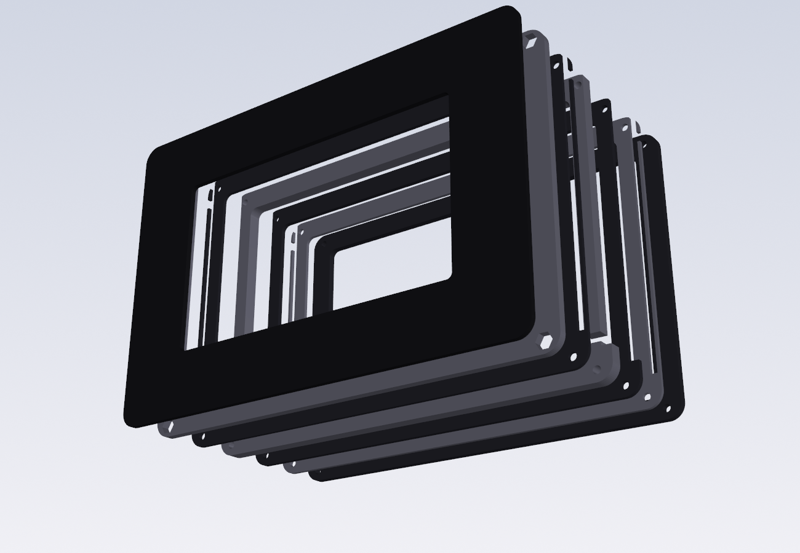
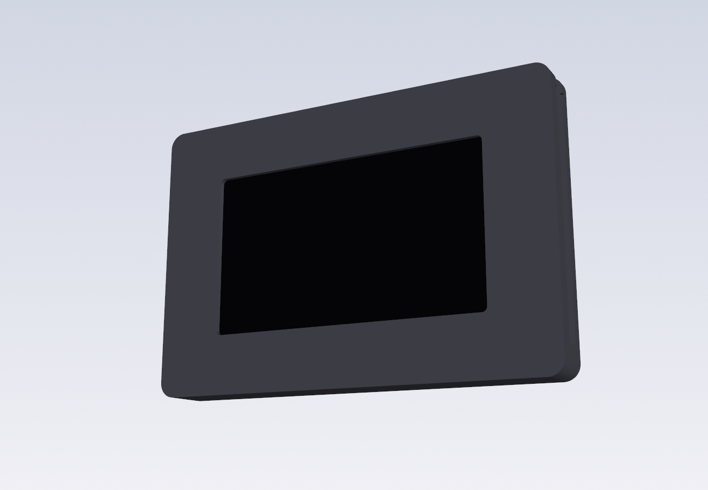
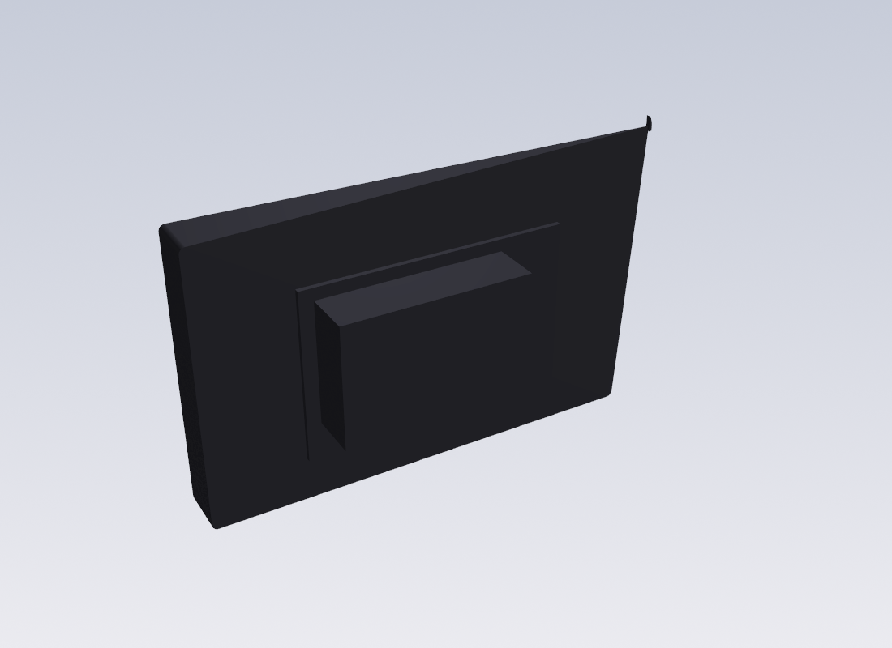
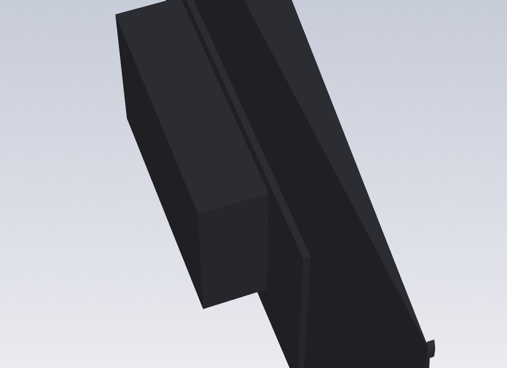

# Pi 5 · 5" Touch Display 2 · Joy-Con handheld — laser-cut acrylic, open back

An 18 mm acrylic frame around the official **Raspberry Pi Touch Display 2 (5")**.
The **Raspberry Pi 5** bolts to the display's own posts and hangs out the open
back with its cooler / NVMe exposed. Real Switch Joy-Cons slide down into
**T-slots cut straight into the acrylic layers** — no printing, no glued rails.

**7 acrylic pieces, 4 thicknesses, 18 mm thick.** Front plate + 6 layers, ordered as one DXF sheet per thickness.



| front (screen off) | open back — Pi 5 + cooler exposed |
|---|---|
|  |  |



## The Joy-Con slot — measured, not guessed
On a Switch the **console has the slot** and the **Joy-Con has the male rail**
(the metal strip with the spring pin). Earlier drafts of this repo had that
backwards. Slot dimensions here are taken from
[Cuttlephone](https://github.com/SiloCityLabs/Cuttlephone), the field-tested
open-source phone case that takes real Joy-Cons (`phone_case.scad`):

| | Cuttlephone | this case |
|---|---|---|
| mouth (lip gap) | 7.1 | **7.0** = 5T + 2T layers (deliberately 0.1 tight → sand, never loose) |
| inner cavity width | 10.1 | **10.0** = + two 1.5T pocket layers |
| lip thickness | 0.7 | **1.0** (acrylic needs it; Joy-Con sits 0.3 proud) |
| cavity depth | 2.4 | 2.4 |
| lock notch | 3.8 wide, 9.4 from top, 1.5 deep | same |
| rail length / seat | 91.5 | seat 91.5 below the top edge |

Because the layers stack along the slot's width, the T-slot is nothing but
2-D cuts:

```
outer face →                    ← display cavity
 1.5T  pocket  |▒▒|░░░░░░░░░░|   lip 1.0 + hidden cavity 2.4  (lip removed 3.8 mm at the notch)
 5T    mouth   |░░░░░░░░░░░░░|   full 3.4 cut, open at the top
 2T    mouth   |░░░░░░░░░░░░░|
 1.5T  pocket  |▒▒|░░░░░░░░░░|
```
The slot runs out through the top edge, so the Joy-Con enters from above and
bottoms out on the seat; a 6 mm zone below the seat takes a Joy-Con
charging-rail part, fed 5 V/GND through a 3.2 mm wire slot from the cavity
(Joy-Con pins: 4 = 5 V, 1–2 = GND; use a small buck, not the Pi header).

## v6 stack — the one to build (`out/acrylic/v6_open_slot/`)
| layer | thickness | role |
|---|---|---|
| front | **2T** black/smoked | covers the bezel, window = active area 110.4 × 62.1, glued (VHB) |
| L1 | 3T | hex traps for the 4 M2.5 nuts |
| L2 | **1.5T** | slot pocket + lock notch |
| L3 | 5T | slot mouth + wire slot |
| L4 | 2T | slot mouth |
| L5 | **1.5T** | slot pocket + lock notch |
| L6 | 3T | closes flush with the LCD back (16 mm) |

Body 163 × 109 mm, 18 mm thick. Order one DXF per thickness:
`sheet_1.5T.dxf`, `sheet_2T.dxf`, `sheet_3T.dxf`, `sheet_5T.dxf`.
No 1.5T at your shop? Use 2T for L2/L5 (inner width 11.0 — slight side play).

Hardware: 4 × M2.5 × 22 black button-head + nuts, 0.5 mm VHB, acrylic cement
(optional, to bond the layers). **Cast** acrylic.

## Other versions (`python3 acrylic_panels.py`)
| version | acrylic | notes |
|---|---|---|
| **v6_open_slot** | **18 mm** | LCD-only, open back, T-slots |
| v2_closed_slot | 41 mm | closed box, same slots, visible bolts |
| v3_tablet_norail | 41 mm | no slots — plain Pi tablet |
| v5_cooler_ssd_slot | 51 mm | closed box with cooler + M.2 room, fan window |

## Still to confirm before cutting
1. Display active-area offset in the module (`ACT_DX/DY`, assumed centred).
2. Slot fit on your Joy-Cons — cut L2–L5 first (four small parts), stack them
   with tape, slide a Joy-Con. Binds → sand the 5T/2T faces a touch.
3. That the Pi's underside clears the 16 mm frame back when mounted on the
   display posts.

## Files
```
acrylic_panels.py   the case, all versions  -> out/acrylic/<version>/
joycon_rail.py      SUPERSEDED (modelled a male rail on the case — backwards)
switch_handheld.py  earlier all-3D-printed shell, reference only
```
`pip install cadquery ezdxf`, then run the scripts.
