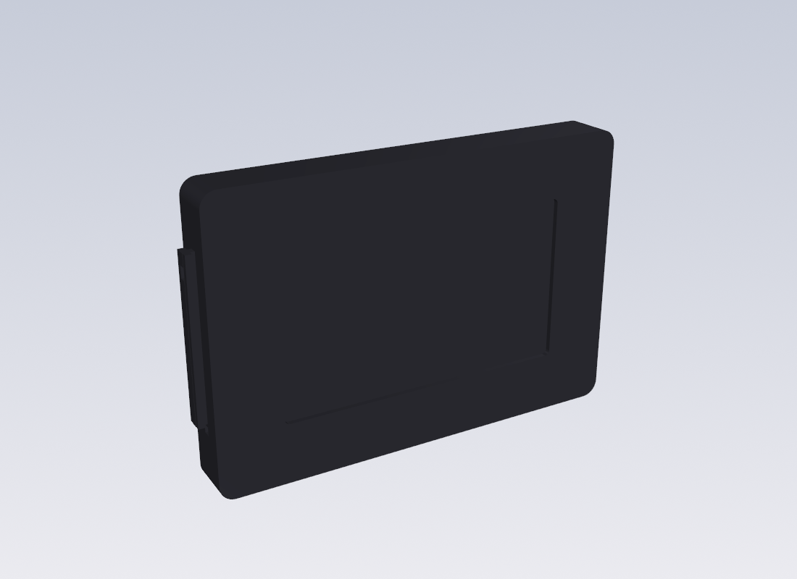
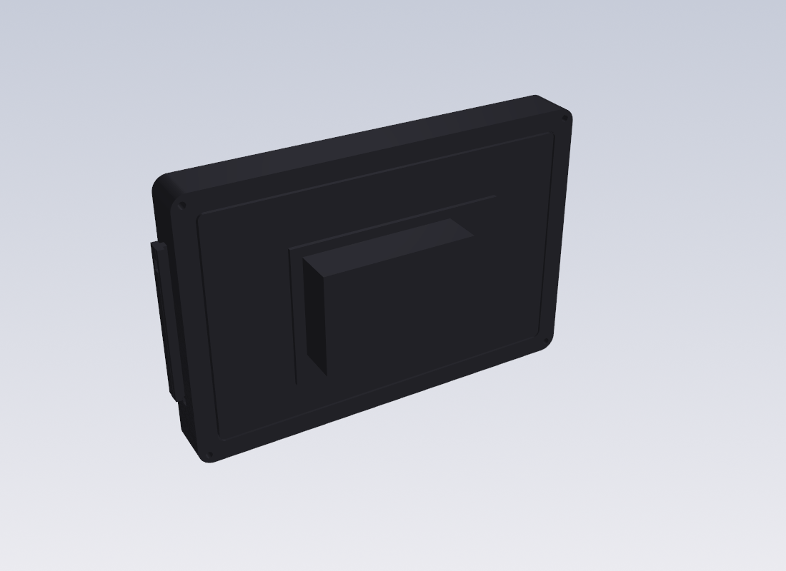

# Pi 5 · 5" Touch Display 2 · Joy-Con handheld — all-acrylic, open back

A laser-cut acrylic frame that wraps **only the LCD** (the official Raspberry Pi
Touch Display 2, 5"). The **Raspberry Pi 5 (85 × 56 mm)** bolts to the display's
own M2.5 posts and hangs out the **open back** with its Active Cooler / NVMe HAT
exposed. Real Switch (1st-gen) **Joy-Cons slide onto acrylic dovetail rails** —
no 3D printing anywhere. 18 mm of acrylic total.




## The idea
* The 5" Touch Display 2 has a wide bezel (module 143.5 × 91.5, active area
  110.4 × 62.1). A **2T black front plate covers the bezel** and shows only the
  active area through a 111.4 × 63.1 window.
* The Pi mounts to the display's back → the case never has to hold the Pi.
  Cavity 145 × 93 (0.75 mm clearance), body 161 × 109, 175 wide with rails
  (a real Switch is 173).
* **Acrylic dovetail rail.** A laser can't cut an undercut, so the T-dovetail is
  *built* from flat parts: the 3T rail layer carries a 4 mm side tab (the neck);
  two 2T head strips (2.5 × 61) are solvent-glued onto both faces of the tab,
  flush with its tip (the head). Neck 3 mm, head 7 mm, 1.5 mm undercut per
  side. The Joy-Con's channel lips ride on smooth sheet faces, not laser edges.
  Latch notch near the top and a 6 mm charge pocket at the bottom are plain 2-D
  features of the rail layer.
* **Joy-Con charging:** strip a USB cable for 5 V/GND, pass it through the 3.2 mm
  wire slot in the rail layer into the pocket, terminate on a Joy-Con
  charging-rail part (iFixit/AliExpress) seated there. Joy-Con pins: 4 = 5 V,
  1–2 = GND. Feed 5 V from a small buck, not the Pi header.
* All fasteners are **through-bolts along the stack** (laser holes are
  perpendicular to the sheet): 4 × M2.5 from the back into nuts trapped in
  layer 1; the front plate is glued with 0.5 mm VHB — no visible hardware.

## v6 stack (headline)
| layer | thickness | what |
|---|---|---|
| front | **2T** black/smoked | bezel cover + active-area window, glued |
| L1 nuttrap | 5T | hex traps for the 4 M2.5 nuts |
| L2 rail | **3T** | Joy-Con neck tabs, latch notch, charge pocket, wire slot |
| L3 display | 5T | |
| L4 display | 3T | ends flush with the LCD's back (16 mm) |
| 4 × head strip | 2T | 2.5 × 61, glued onto the rail tabs |

Order one file per thickness: `sheet_2T.dxf`, `sheet_3T.dxf`, `sheet_5T.dxf` in
`out/acrylic/v6_open_acrylic_rail/`. Manifest in the same folder.

## Other versions (`python3 acrylic_panels.py`)
| version | acrylic | notes |
|---|---|---|
| **v6_open_acrylic_rail** | **18 mm** | LCD-only frame, open back, acrylic rails — the one to build |
| v1_slim_black | 39 mm | closed slim box, printed rail modules, hidden hardware |
| v2_standard | 41 mm | closed, visible bolts, easy to open |
| v3_tablet_norail | 41 mm | no rails — a plain Pi tablet |
| v5_cooler_ssd | 51 mm | closed box with cooler + M.2 room, 48 mm fan window |

v1/v2/v5 use the 3D-printed rail modules from `joycon_rail.py`
(`out/joycon_rail_acrylic_L/R.stl`, an 8 mm flange clamps into the middle layer).

## Acrylic: what to order
* **Cast** acrylic (clean glossy laser edge). Front 2T black or smoked; layers
  as in the table. Head strips from the 2T sheet.
* Holes 2.8 mm = M2.5 clearance (same screws as the display posts); kerf
  ~0.15 mm is already absorbed by that.
* Glue: acrylic cement (Acrifix / Weld-On 4) for the head strips; VHB for the front.

## Not verified yet — MEASURE / CONFIRM
Nothing has been cut. Marked in the scripts:
1. Display active-area offset in the module (`ACT_DX/DY`, assumed centred).
2. **Rail fit** — the dovetail dims have no clean public spec (community models
   are tune-to-fit). Copy your real Switch console's rail 1:1 if you can measure
   it; otherwise cut the rail layer + strips once, slide a Joy-Con, and tune
   `RAIL_OUT / HEAD_W / HEAD_T`.
3. Display module depth 16 mm and where the Pi's underside lands behind it.

## Files
```
acrylic_panels.py   laser-cut sandwich, all versions  -> out/acrylic/<version>/
joycon_rail.py      printed dovetail rail modules (v1/v2/v5) -> out/joycon_rail_*.stl
switch_handheld.py  earlier all-3D-printed shell, kept for reference
```
Regenerate: `pip install cadquery ezdxf`, then run the scripts.
