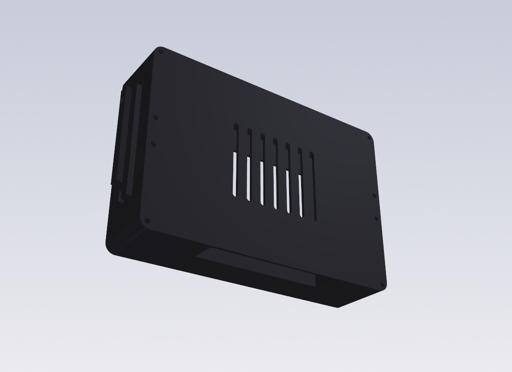

# Pi 5 · 5" Touch Display 2 · Joy-Con handheld — laser-cut acrylic case

A slim sandwich case for a **Raspberry Pi 5** bolted to the back of the official
**Raspberry Pi Touch Display 2 (5")**, with **real Switch (1st-gen) Joy-Cons**
sliding onto 3D-printed dovetail rails on both sides. Everything is generated
parametrically with CadQuery; you get DXF sheets for the acrylic shop and STLs
for the two rail modules.



## Why this shape
* The Pi 5 mounts on the display's own M2.5 posts → the case wraps **one
  display+Pi block**. No Pi standoffs, no cable-routing gymnastics.
* The 5" Touch Display 2 has a wide bezel (module 143.5 × 91.5, active area only
  110.4 × 62.1). A thin **dark front plate covers the bezel** and shows just the
  active area through a window — the Apple trick.
* A laser only cuts perpendicular to the sheet, so every fastener is a
  **through-bolt along the stack**. The printed rail has an 8 mm flange that
  drops into a notch in the middle layer and is clamped by two of those bolts.

## Versions (`python3 acrylic_panels.py`)
| version | front | spacers | back | stack | what it is |
|---|---|---|---|---|---|
| `v1_slim_black` | 2T, no holes (glued) | 7 × 5T | 2T | **39 mm** | hidden hardware: bolts from the back into M2.5 nuts trapped in layer 1 |
| `v2_standard` | 3T, bolted | 7 × 5T | 3T | 41 mm | black button-heads visible, easiest to open |
| `v3_tablet_norail` | 3T | 7 × 5T | 3T | 41 mm | no Joy-Con rails — a plain Pi tablet |
| `v4_open_back` | 3T | 7 × 5T | — | 38 mm | back open for airflow / a visible Pi |
| `v5_cooler_ssd` | 3T | 9 × 5T | 3T + fan window | 51 mm | room for the Active Cooler + an M.2 HAT+/NVMe SSD |

Body 161 × 109 mm; with rails 175 mm wide (a real Switch is 173). Each version
folder has `sheet_<thickness>.dxf` (what the shop cuts), individual panel DXFs,
`manifest.txt`, and a `stack_preview.stl`.

## Acrylic: what to order
* **Cast (캐스트) acrylic**, not extruded — cleaner glossy laser edge.
* Front **2T black or smoked** (v1) / 3T (others). Spacers **5T**. Back 2T/3T.
* Order one file per thickness: `sheet_2T.dxf`, `sheet_3T.dxf`, `sheet_5T.dxf`.
* Holes are 2.8 mm = **M2.5 clearance** (same screws as the display posts).
  Kerf ~0.15 mm is already accounted for by that clearance.
* Bolts: M2.5 × (stack + 4) mm black button-head + nuts. v1: M2.5 nuts sit in
  hex traps in layer 1 and the front is glued with 0.5 mm VHB tape.

## Joy-Con rails (`python3 joycon_rail.py`)
`out/joycon_rail_acrylic_L/R.stl` — print slide-axis-up (dovetail walls come out
vertical, no supports). `joycon_rail_L/R.stl` adds a foot for a printed case.

**The dovetail is MEASURE-TO-CONFIRM.** No clean public spec exists (community
models are tune-to-fit and Joy-Cons vary). Best reference is your own Switch
console's rail — this case is a console replacement, so copy it 1:1. Print one
rail, slide a Joy-Con on, then tune `RAIL_BASE / RAIL_HEAD / RAIL_OUT`.

## Joy-Con charging
Joy-Con connector: **pin 4 = 5 V, pins 1–2 = GND** (dekuNukem RE). Strip a USB
cable for 5 V/GND, route it through the 3.2 mm wire notch in the rail layer into
the pocket at the rail base, and terminate on a Joy-Con charging-rail part
(iFixit / AliExpress) seated in that pocket. Feed 5 V from a small buck, not the
Pi header. Fine-pitch soldering — use flux and a thin tip.

## Not verified yet
Nothing here has been cut or printed. Open items are marked CONFIRM/MEASURE in
the scripts: the display active-area offset, the display+Pi stack depth (sets
layer count), the Pi port positions for the bottom I/O notch, and the rail fit.

## Files
```
acrylic_panels.py   laser-cut sandwich, 5 versions -> out/acrylic/<version>/
joycon_rail.py      printed dovetail rail modules -> out/joycon_rail_*.stl
switch_handheld.py  earlier all-3D-printed shell (same footprint), kept for reference
```
Regenerate: `pip install cadquery ezdxf` then run the scripts.
