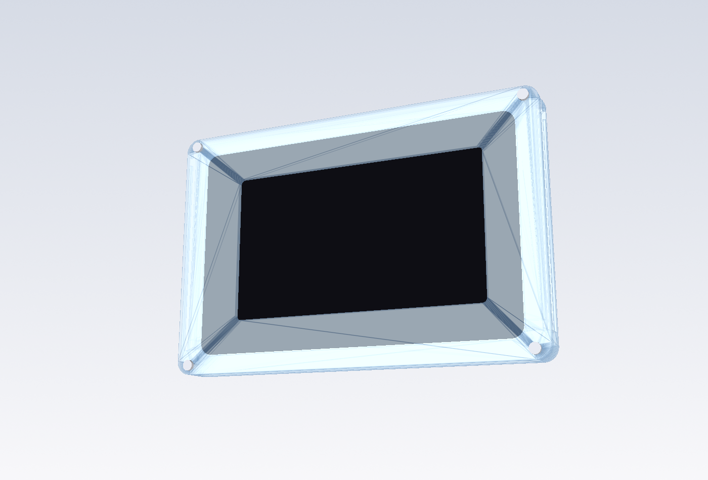
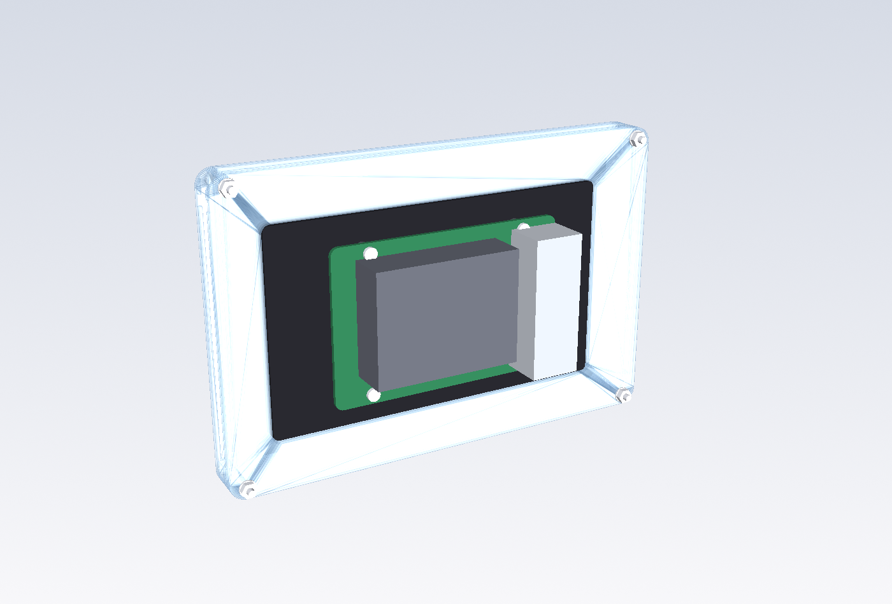
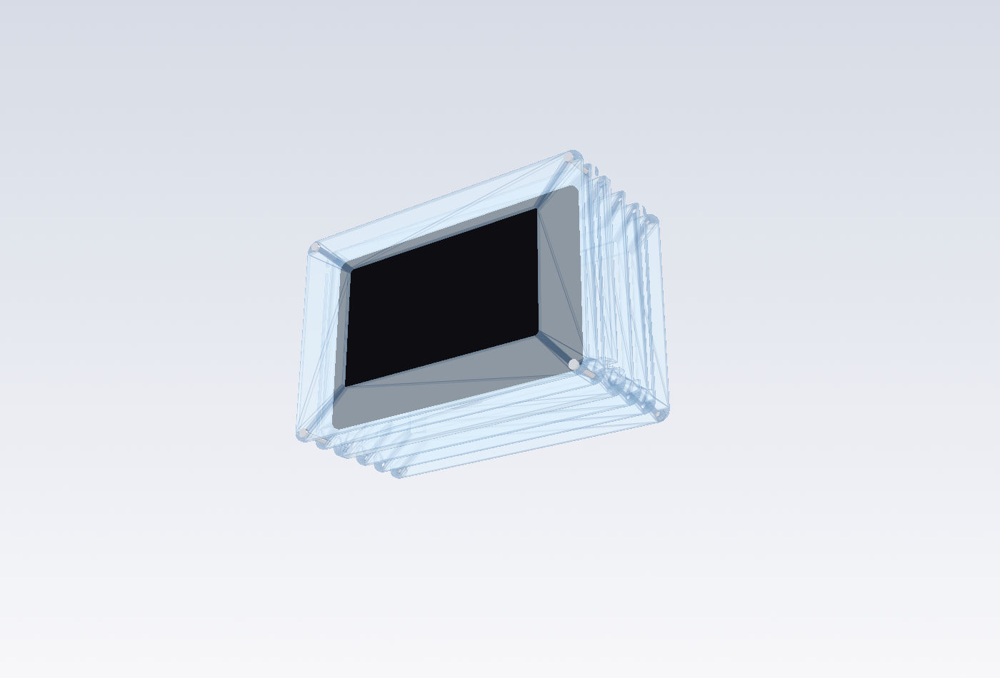
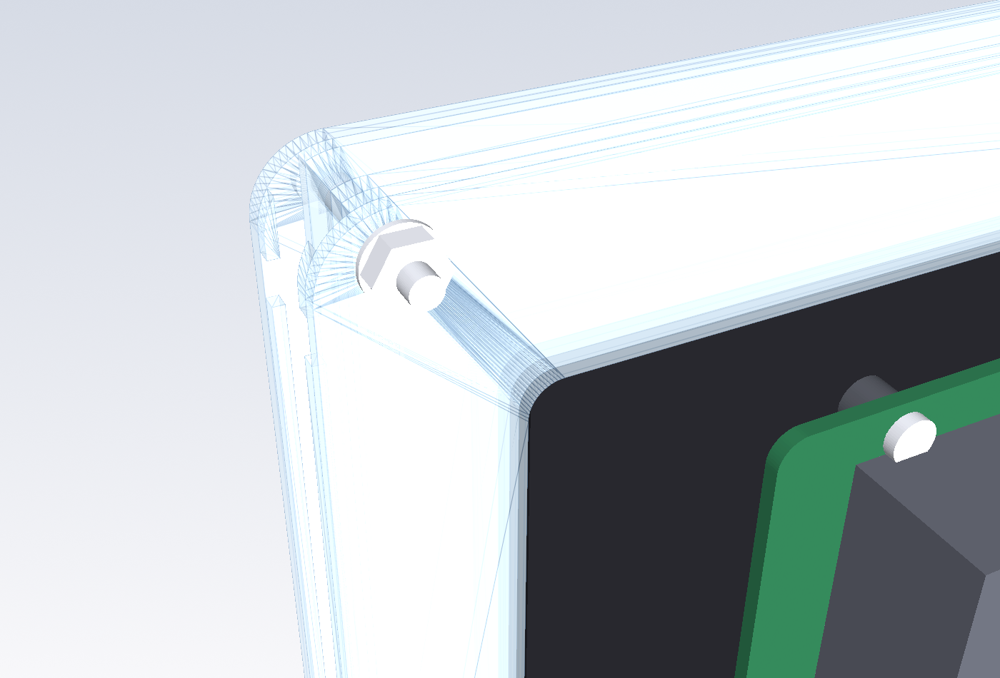
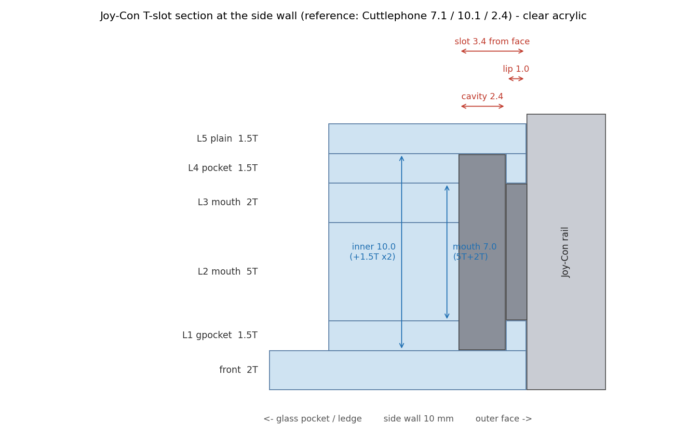

# Pi 5 + 5" Touch Display 2 + Joy-Con
## Clear Laser-Cut Acrylic Handheld

**Status: DESIGN VALIDATED AGAINST REFERENCE DIMENSIONS (official 5" STEP + Cuttlephone) —
PHYSICAL FIT NOT YET VERIFIED.** Nothing has been cut. Cut the fit coupon before the case
(`ORDER.md`).

| front | rear (open back) |
|---|---|
|  |  |

| exploded | corner: glass pocket → ledge |
|---|---|
|  |  |



## What it is
A **13.5 mm** stack of **clear cast acrylic** around the official **Raspberry Pi Touch
Display 2 (5")**, open at the back so the **Raspberry Pi 5**, its Active Cooler / NVMe
HAT and cables stay visible. Real first-generation **Joy-Cons slide down into female
T-slots** cut into the side walls — no 3D printing, no glue. All case fasteners are
**silver M2.5 button-heads** on the front, washer + nut on the rear face.

Body 164.4 × 108.5 mm. Source of truth for every number: `acrylic_panels.py`;
`verify_dxf.py` re-measures the exported DXFs against it.

## Versions
| version | pocket layers | raw Joy-Con inner | total | sheets | use when |
|---|---|---|---|---|---|
| **v7_clear_exact** | 1.5T | 10.0 mm | 13.5 mm | 1.5T · 2T · 5T | the shop can cut 1.5T clear cast |
| **v7_clear_acrylzip** | 2T | 11.0 mm → **~10.1 with 0.45 mm PET liners** | 13.0 mm | 2T · 5T | standard-thickness quotes (Acrylzip 아크리애) |

Fit coupons: `out/acrylic/test_coupon_exact/`, `out/acrylic/test_coupon_acrylzip/`.

## The display, measured from the official STEP
`reference/td2_5in.step` is Raspberry Pi's own 5" model (RP-009152-DD-1, public on the
Product Information Portal). Read with CadQuery; landscape here = display long axis
along case X, origin at the glass centre.

| feature | mm | in code |
|---|---|---|
| cover glass | 143.40 × 91.46 × **0.70**, corners **R5.0** | `GLASS_*` |
| rear frame (largest rear body) | 124.74 × 72.96, centre **x −3.47** from the glass centre, **9.70** behind the glass back | `FRAME_*` |
| glass + frame envelope in the STEP | **10.40** — what the acrylic pocket is sized to | `STEP_BODY_D` |
| complete product depth (documentation) | **16.0** — includes the rear stand-offs and what mounts on them | `OFFICIAL_DEPTH` |
| active-area (panel) centre | **x −2.47** from the glass centre → bezel 13.5 mm one end, 18.4 the other | `PANEL_DX` → `ACT_DX` |
| four rear M2.5-size bosses | (±51.85, ±25.5) = **103.7 × 51.0** — display assembly features, *not* Pi mounting | `STEP_REAR_BOSSES` |
| Pi mounting stand-offs | **not modelled in the STEP** | — |
| anything outside the frame footprint or behind its rear plane | none | |
| active / viewing area (product brief) | 110.4 × 62.1 / 111.5 × 63.0 | `ACTIVE_*`, `VIEW_*` |

The window is cut to the **viewing** area + 0.25 mm/side = 112.0 × 63.5, centred on the
panel (x −2.47), not on the glass. Active and viewing areas are separate variables.
Official drawings are reference-only: **measure a real display before any volume order**
(the sign of `ACT_DX` flips if you rotate the display the other way).

### How the display is held (like every bezel)
```
front 2T  ────────────────────────   clear, window over the viewing area
L1 1.5T   glass pocket 144.4 × 92.46 : the 0.70 glass sits here, gasket ring behind its border
L2…       ledge cavity 126.24 × 74.46: the glass border rests on this step (≥ 4.6 mm wide)
          the 9.7 mm rear frame passes through; open back
```
Body depth is sized to the STEP's 10.40 mm glass + frame envelope, **not** to the 16 mm
complete-product depth in the documentation — the difference is the rear stand-offs and
the Pi, which deliberately stick out of the open back.
Forward: front plate. Backward: the ledge. Nothing else is needed — the earlier
"rear retaining bars" idea was wrong: at the module's edge there is only 0.7 mm of glass,
no rear surface to press on. The **STEP-modelled glass/frame body** ends 1.1 mm (exact) / 0.6 mm (acrylzip) inside
the case back; the rear stand-offs and the Pi bolted to them project out through the
open back, which is why the complete product is documented as 16 mm deep while the
acrylic body is only 11.5.

### Pi 5 mounting
Per Raspberry Pi's documentation you can mount **any SBC form-factor Raspberry Pi
directly to the back of the Touch Display 2**: align the Pi with the **four corner
stand-offs** on the display rear and secure it with the **four supplied M2.5 screws**.
That is the method assumed here. Cables: 22→15-way FFC, display J1 → Pi GPIO power.

Those four screws hold the Pi to the display. They are **not** the case bolts and have
nothing to do with holding the display in the acrylic.

The STEP models the glass and frame body only — it does **not** model the stand-offs, so
their exact coordinates and height are not published data. The preview therefore draws
the Pi's 58 × 49 pattern centred on the display's rear frame, at a nominal 4 mm
stand-off height; treat that placement as illustration. (An earlier revision of this
repo misread the STEP's four 103.7 × 51.0 rear bosses as the Pi mounting points and
wrongly concluded a bracket was required. Those bosses are display assembly features.
No case geometry was ever derived from them.)

## Joy-Con slot
Nintendo puts the **female slot on the console** and the **male rail on the Joy-Con**.
Reference geometry is derived from the field-tested
[Cuttlephone](https://github.com/SiloCityLabs/Cuttlephone) design (`phone_case.scad`):
mouth 7.1, inner 10.1, cavity 2.4, lock notch 3.8 wide 9.4 from the top, rail 91.5.
Laser kerf and actual sheet thickness still require a physical fit test.

Built from the layer stack, so it is only 2-D cuts:
```
 outer face →                            ← inside
 L1 gpocket 1.5T |▒▒|░░░░░░░░░░░|  lip 1.0 + hidden cavity 2.4 (lip removed 3.8 mm at the notch)
 L2 mouth   5T   |░░░░░░░░░░░░░░|  full 3.4 cut, open at the top edge, + wire slot
 L3 mouth   2T   |░░░░░░░░░░░░░░|
 L4 pocket  1.5T |▒▒|░░░░░░░░░░░|
```
mouth = 5T + 2T = 7.0 (0.1 under reference — tight on purpose: sand, never loosen);
inner = 7.0 + 2 × pocket. Lip 1.0 instead of Nintendo's 0.7 (acrylic). The slot runs
out through the top edge; the Joy-Con seats 91.5 mm below it; a 6 mm zone below takes a
Joy-Con charging-rail part fed through the 3.2 mm wire slot (pin 4 = 5 V, pins 1–2 = GND).

## Bezel (cosmetic, optional)
The front is clear, so the display's black bezel shows through it — that is the design.
To hide it, put black vinyl / masking film on the **back** of the front plate, leaving the
112.0 × 63.5 window open. No extra sheet.

## Kerf
DXF geometry is nominal finished geometry; the shop applies cutter compensation; do not
add your own offset. Slot widths come from sheet thickness, hence the coupon.

## Still to verify on hardware
1. Joy-Con fit on **your** Joy-Cons — cut a coupon.
2. Real glass/frame dimensions vs the STEP on your unit (reference-only drawings).
3. Stand-off positions and height on a real display (not in the STEP), and that the
   Pi + Active Cooler clear the case back as drawn.

## Files
```
acrylic_panels.py    all geometry + design checks (raises before exporting on failure)
verify_dxf.py        re-measures the exported DXFs against the code
render_previews.py   preview PNGs (VTK) + slot section (matplotlib)
ORDER.md             what to order, per version, plus hardware BOM
reference/measure_step.py  re-measures the official 5" STEP -> every display number here
reference/README.md        how to download td2_5in.step (5.2 MB, deliberately not committed)
out/acrylic/v7_clear_exact/        DXFs, sheet_*.dxf, manifest.txt, previews (front/back/exploded/slot/ledge), stack_preview.stl
out/acrylic/v7_clear_acrylzip/     standard-thickness fallback
out/acrylic/test_coupon_exact/     fit coupon (cut first)
out/acrylic/test_coupon_acrylzip/  fit coupon, standard thicknesses
legacy/                            earlier drafts — NOT FOR FABRICATION
```
`pip install cadquery ezdxf`, then `python3 acrylic_panels.py && python3 verify_dxf.py && python3 render_previews.py`.
