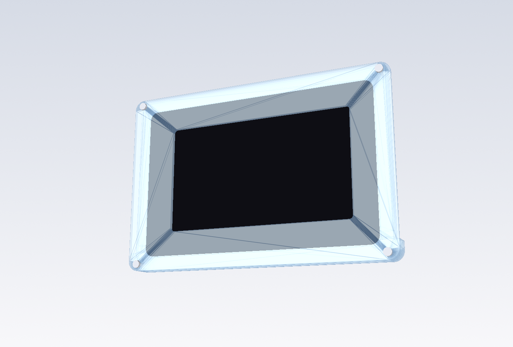
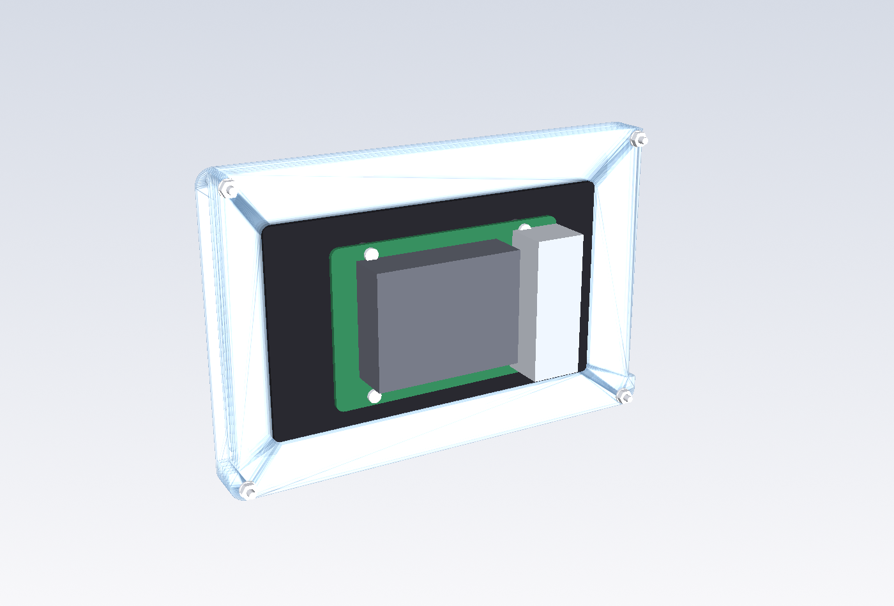
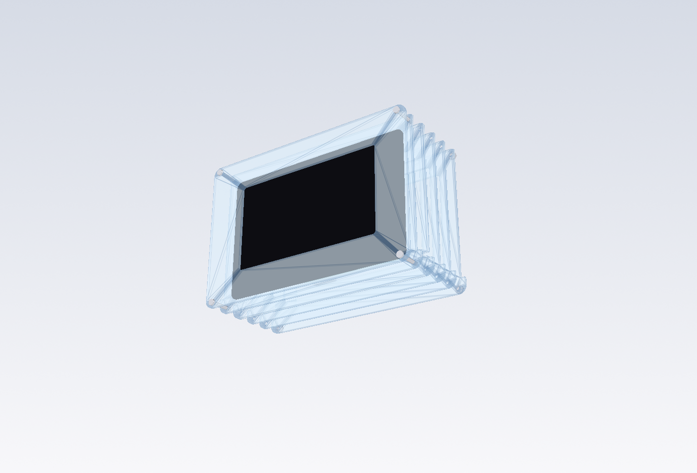
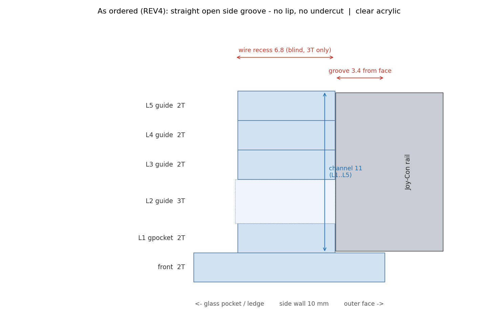

# Pi 5 + 5" Touch Display 2 + Joy-Con
## Clear Laser-Cut Acrylic Handheld

**Status: v8 SUBMITTED FOR FABRICATION — PHYSICAL FIT NOT YET VERIFIED.**
Neither the Joy-Con guide nor the display fit has been checked on real parts.
Geometry is validated against the official 5" STEP, the Cuttlephone reference and the
ordered drawing itself (`python3 verify_dxf.py`).

| front | rear (open back) |
|---|---|
|  |  |

| exploded | side guide section |
|---|---|
|  |  |

## What it is
A **13.0 mm** stack of **clear cast acrylic** around the official **Raspberry Pi Touch
Display 2 (5")**, open at the back so the **Raspberry Pi 5**, its Active Cooler / NVMe
HAT and cables stay visible. Real first-generation **Joy-Cons slide into straight open
grooves** cut into the side walls — no 3D printing, no glue. All case fasteners are
**silver M2.5 button-heads** on the front, washer + nut on the rear face.

Body 164.4 × 108.5 mm, 6 acrylic pieces. Source of truth for every number:
`acrylic_panels.py`; `verify_dxf.py` re-measures the exported DXFs against it *and*
against dimensions read off the ordered drawing.

**Build it from [`ASSEMBLY.md`](ASSEMBLY.md); order it from [`ORDER.md`](ORDER.md).**

> **Parts fabricated.** The straight groove locates a Joy-Con but does **not** retain it:
> the mouth is 11.0 mm, the rail head is 10.1 mm, and with no undercut nothing overhangs
> it. That is the accepted cost of dropping the 1 mm lip, not a fabrication error.
> `out/acrylic/v8r_liplayers_recut/` re-cuts **only L1 and L5** with the blind lip pocket
> to restore a real T-slot (mouth 7.0), reusing the front, L2, L3 and L4 you already have.
> See ASSEMBLY.md §6.

## Versions
| version | side guide | layers | total | sheets | status |
|---|---|---|---|---|---|
| **v8_clear_straightguide_ordered** | straight groove 3.4 deep, no lip | 2 / 2 / **3** / 2 / 2 / 2 | **13.0 mm** | 2T · 3T | **ordered / fabricated** |
| v7_clear_exact | T-slot, 1.5T pockets, inner 10.0 | 2 / 1.5 / 5 / 2 / 1.5 / 1.5 | 13.5 mm | 1.5T · 2T · 5T | earlier reference |
| v7_clear_acrylzip | T-slot, 2T pockets, inner 11.0 (+PET liners) | 2 / 2 / 5 / 2 / 2 | 13.0 mm | 2T · 5T | earlier reference |

Every version has a matching fit coupon in `out/acrylic/test_coupon_<version>/`.

## Design history
1. **v7 T-slot** (`v7_clear_exact`, `v7_clear_acrylzip`) — female T-slot with a 1.0 mm
   acrylic lip, built from stacked pocket/mouth layers. Kept as reference; **not** what
   was ordered.
2. **v8 straight guide** — the ordered revision. The T-slot left a 1.0 mm lip running the
   full length of the slot on the pocket layers: laser-cuttable, but a long thin acrylic
   tongue and judged mechanically fragile. It was replaced by a plain straight groove in
   every structural layer, so the side wall keeps full section. The 5T sheet was dropped
   and its depth redistributed as 3T + one more 2T layer, holding the total at 13.0 mm.
   The cost is that a straight groove has no undercut: it guides the Joy-Con but does not
   lock it, so some lateral play is expected and accepted.
3. **Jetson Nano / Orin experiments** — a separate line of work that considered a Jetson
   as the brain instead of a Raspberry Pi. Never part of this repository's design and
   **not part of this order**. Only a stale comment in `legacy/switch_handheld.py`
   survives from it.

## As ordered (v8)
Fabricated from `KETI_Acrylic_Order_REV4_StraightGuide_Transparent_2T_3T.dxf`:
transparent acrylic, **Front 2T + L1 2T + L2 3T + L3 2T + L4 2T + L5 2T = 6 pieces,
13.0 mm**, body ≈ 164.4 × 108.5 mm, open rear, M2.5 through-bolt assembly, no acrylic glue.

* **Side guide** — straight open groove, **3.4 mm** deep, open at the top edge, **91.5 mm**
  of guide with a **6 mm** contact bay below it (97.5 mm of groove, ~11 mm of solid
  acrylic under that). Present in L1–L5; the front plate has no groove and closes the
  front of the 11 mm channel. No 1 mm tongues anywhere.
* **L2 (3T)** keeps a **3.2 × 6.8 mm wire recess** on both sides in the contact-bay
  region, for future charging contacts. As drawn it is **blind** — it stops 5.4 mm short
  of the display cavity, so feeding a wire in from the inside needs an opening that is
  not in the ordered drawing.
* Optional thin clear PET/tape may be added to the groove faces after a physical fit test.

`verify_dxf.py` checks the generated v8 DXFs against dimensions measured from that
drawing: outline, bolt pattern, window size and offset, glass pocket, ledge cavity and
offset, groove floor and bottom, wire recess, and the 2/2/3/2/2/2 thickness list.

## Assembly, front to rear
```
M2.5 button-head → front 2T → Touch Display 2 → L1 2T → L2 3T → L3 2T → L4 2T → L5 2T → washer + nut
```
The display is **not** sandwiched between two flat sheets: its 0.70 mm cover glass is
seated in the **L1 pocket** (144.40 × 92.46), and L2–L5 have a smaller frame-shaped
cavity (126.24 × 74.46, offset x −3.47) so the glass border rests on that ledge while the
rear frame passes through. Full procedure in [`ASSEMBLY.md`](ASSEMBLY.md).

## The display, measured from the official STEP
`reference/td2_5in.step` is Raspberry Pi's own 5" model (RP-009152-DD-1, public on the
Product Information Portal). Read with CadQuery; landscape here = display long axis
along case X, origin at the glass centre.

| feature | mm | in code |
|---|---|---|
| cover glass | 143.40 × 91.46 × **0.70**, corners **R5.0** | `GLASS_*` |
| rear frame (largest rear body) | 124.74 × 72.96, centre **x −3.47** from the glass centre, **9.70** behind the glass back | `FRAME_*` |
| glass + frame envelope in the STEP | **10.40** — what the acrylic pocket is sized to | `STEP_BODY_D` |
| complete product depth (documentation) | **16.0** — includes the rear stand-offs and what mounts on them | `OFFICIAL_DEPTH` |
| active-area (panel) centre | **x −2.47** from the glass centre → bezel 13.5 mm one end, 18.4 the other | `PANEL_DX` → `ACT_DX` |
| four rear M2.5-size bosses | (±51.85, ±25.5) = **103.7 × 51.0** — display assembly features, *not* Pi mounting | `STEP_REAR_BOSSES` |
| Pi mounting stand-offs | **not modelled in the STEP** | — |
| anything outside the frame footprint or behind its rear plane | none | |
| active / viewing area (product brief) | 110.4 × 62.1 / 111.5 × 63.0 | `ACTIVE_*`, `VIEW_*` |

The window is cut to the **viewing** area + 0.25 mm/side = 112.0 × 63.5, centred on the
panel (x −2.47), not on the glass. Active and viewing areas are separate variables.
Official drawings are reference-only: **measure a real display before any volume order**
(the sign of `ACT_DX` flips if you rotate the display the other way).

### How the display is held (like every bezel)
```
front 2T  ────────────────────────   clear, window over the viewing area
L1 1.5T   glass pocket 144.4 × 92.46 : the 0.70 glass sits here, gasket ring behind its border
L2…       ledge cavity 126.24 × 74.46: the glass border rests on this step (≥ 4.6 mm wide)
          the 9.7 mm rear frame passes through; open back
```
Body depth is sized to the STEP's 10.40 mm glass + frame envelope, **not** to the 16 mm
complete-product depth in the documentation — the difference is the rear stand-offs and
the Pi, which deliberately stick out of the open back.
Forward: front plate. Backward: the ledge. Nothing else is needed — the earlier
"rear retaining bars" idea was wrong: at the module's edge there is only 0.7 mm of glass,
no rear surface to press on. The **STEP-modelled glass/frame body** ends 1.1 mm (exact) / 0.6 mm (acrylzip) inside
the case back; the rear stand-offs and the Pi bolted to them project out through the
open back, which is why the complete product is documented as 16 mm deep while the
acrylic body is only 11.5.

### Pi 5 mounting
Per Raspberry Pi's documentation you can mount **any SBC form-factor Raspberry Pi
directly to the back of the Touch Display 2**: align the Pi with the **four corner
stand-offs** on the display rear and secure it with the **four supplied M2.5 screws**.
That is the method assumed here. Cables: 22→15-way FFC, display J1 → Pi GPIO power.

Those four screws hold the Pi to the display. They are **not** the case bolts and have
nothing to do with holding the display in the acrylic.

The STEP models the glass and frame body only — it does **not** model the stand-offs, so
their exact coordinates and height are not published data. The preview therefore draws
the Pi's 58 × 49 pattern centred on the display's rear frame, at a nominal 4 mm
stand-off height; treat that placement as illustration. (An earlier revision of this
repo misread the STEP's four 103.7 × 51.0 rear bosses as the Pi mounting points and
wrongly concluded a bracket was required. Those bosses are display assembly features.
No case geometry was ever derived from them.)

## Joy-Con geometry (v7 reference)
The ordered v8 replaces this T-slot with a plain groove (see *Design history*); the
reference numbers below are why the slot sits where it does, and still set the guide
length, contact bay and groove depth in v8.

Nintendo puts the **female slot on the console** and the **male rail on the Joy-Con**.
Reference geometry is derived from the field-tested
[Cuttlephone](https://github.com/SiloCityLabs/Cuttlephone) design (`phone_case.scad`):
mouth 7.1, inner 10.1, cavity 2.4, lock notch 3.8 wide 9.4 from the top, rail 91.5.
Laser kerf and actual sheet thickness still require a physical fit test.

In v7 this was built from the layer stack as a T profile (mouth 5T + 2T = 7.0, inner
7.0 + 2 × pocket, lip 1.0). **v8 drops the lip entirely** and cuts one plain 3.4 mm
groove per layer instead; what carries over is the extent — open at the top edge, Joy-Con
seated 91.5 mm below it, 6 mm contact bay under that for a Joy-Con charging-rail part
(pin 4 = 5 V, pins 1–2 = GND).

## Bezel (cosmetic, optional)
The front is clear, so the display's black bezel shows through it — that is the design.
To hide it, put black vinyl / masking film on the **back** of the front plate, leaving the
112.0 × 63.5 window open. No extra sheet.

## Kerf
DXF geometry is nominal finished geometry; the shop applies cutter compensation; do not
add your own offset. Slot widths come from sheet thickness, hence the coupon.

## Still to verify on hardware
1. **Joy-Con fit in the straight guide** — how much lateral play there actually is, and
   whether a PET/tape liner is wanted. Nothing has been tried on real parts.
2. Real glass/frame dimensions vs the STEP on your unit (reference-only drawings).
3. Stand-off positions and height on a real display (not in the STEP), and that the
   Pi + Active Cooler clear the case back as drawn.

## Files
```
acrylic_panels.py    all geometry + design checks (raises before exporting on failure)
verify_dxf.py        re-measures the exported DXFs against the code
render_previews.py   preview PNGs (VTK) + slot section (matplotlib)
ORDER.md             what to order, per version, plus hardware BOM
ASSEMBLY.md          build order and procedure for the as-ordered v8
reference/measure_step.py  re-measures the official 5" STEP -> every display number here
reference/README.md        how to download td2_5in.step (5.2 MB, deliberately not committed)
out/acrylic/v8_clear_straightguide_ordered/  AS ORDERED - DXFs, sheet_*.dxf, manifest.txt, previews, STL
out/acrylic/v8r_liplayers_recut/   retrofit: 2 replacement plates (L1r, L5r) that add the missing undercut
out/acrylic/v7_clear_exact/        earlier T-slot reference
out/acrylic/v7_clear_acrylzip/     earlier T-slot reference, standard thicknesses
out/acrylic/test_coupon_ordered/   fit coupon for the ordered guide
out/acrylic/test_coupon_exact/     fit coupon, v7
out/acrylic/test_coupon_acrylzip/  fit coupon, v7
legacy/                            earlier drafts — NOT FOR FABRICATION
```
`pip install cadquery ezdxf`, then `python3 acrylic_panels.py && python3 verify_dxf.py && python3 render_previews.py`.
